# AeroXP
An aero theme for steam based off of the ui of Windows Media Player 11 on Windows XP.

# Previews
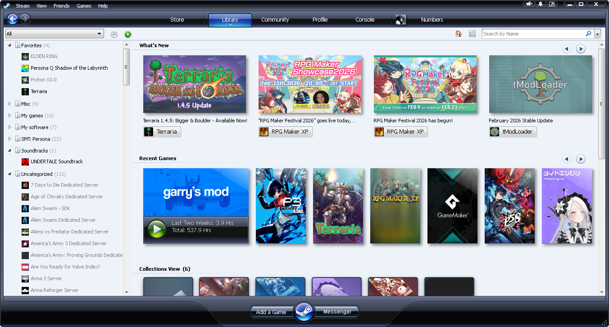
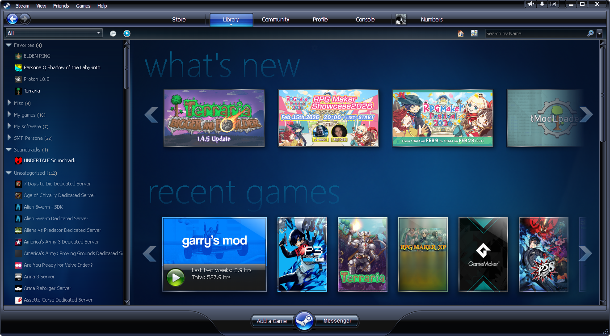

  

More previews

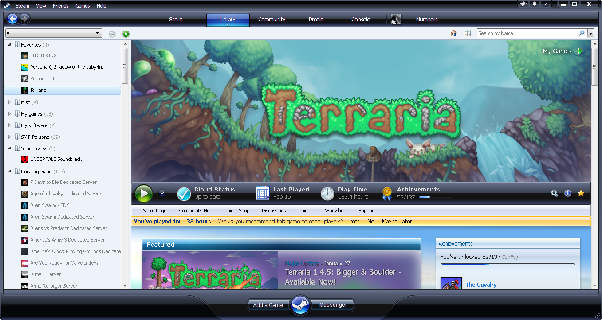
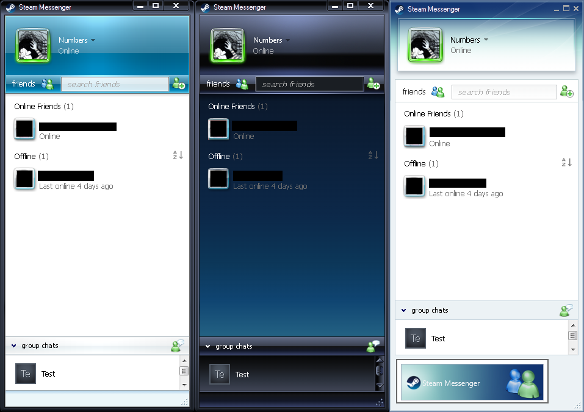
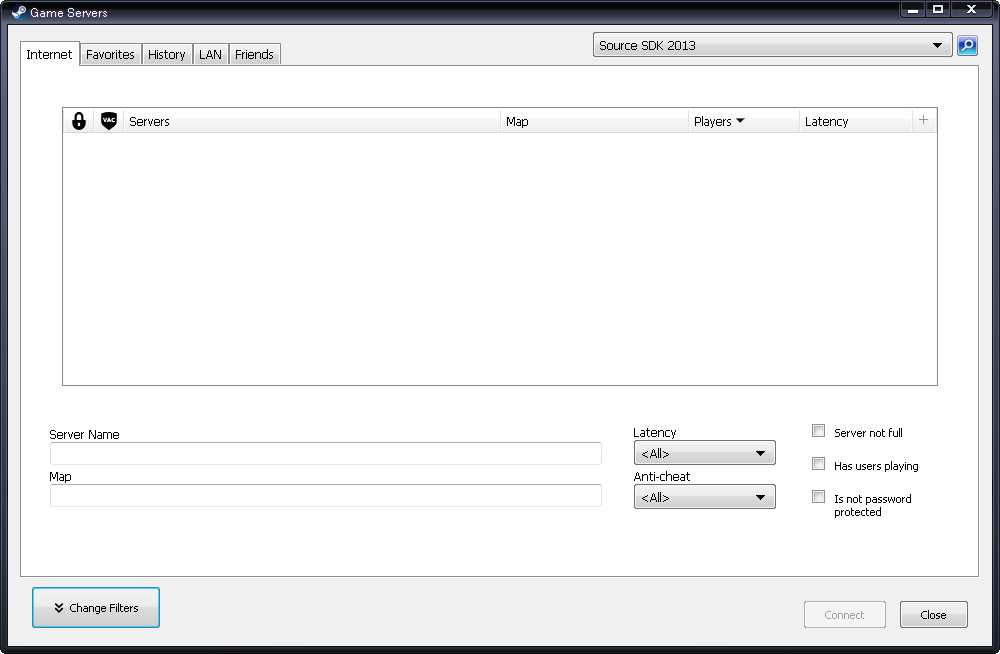
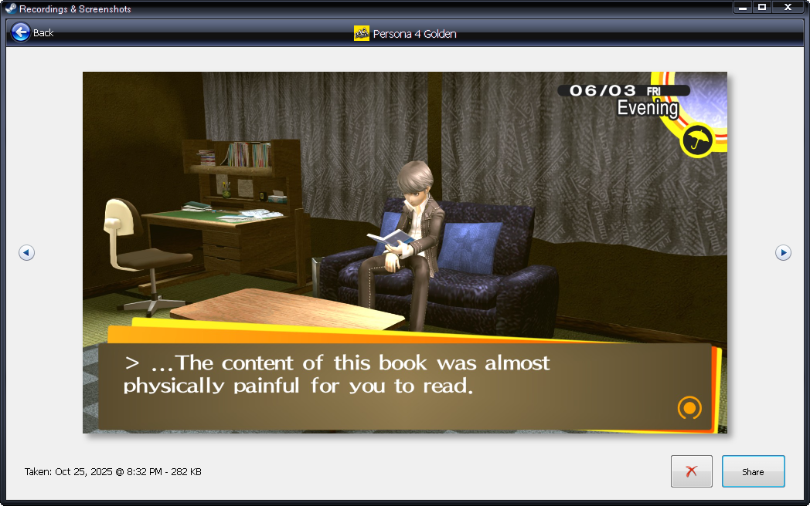

# Plugin
This theme is designed to be compatible with the [Change Window Params](https://steambrew.app/plugin?id=70961284c213) plugin, although it’s not necessary for using the theme.

Enabling the plugin will allow use of rounded corners with the “transparent windows” setting and native title bars with the “use system titlebar” setting, settings for this are in the advanced tab of the theme’s settings.

  

Previews

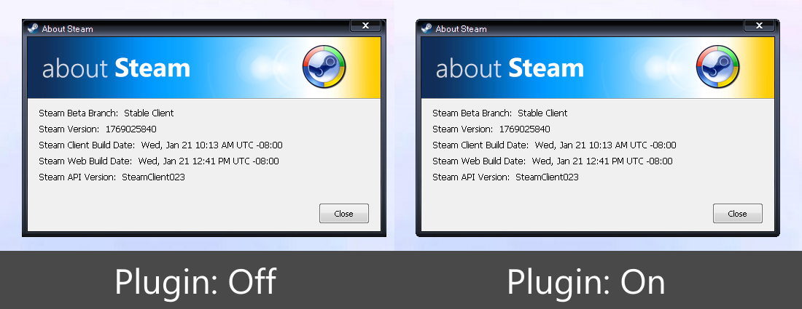
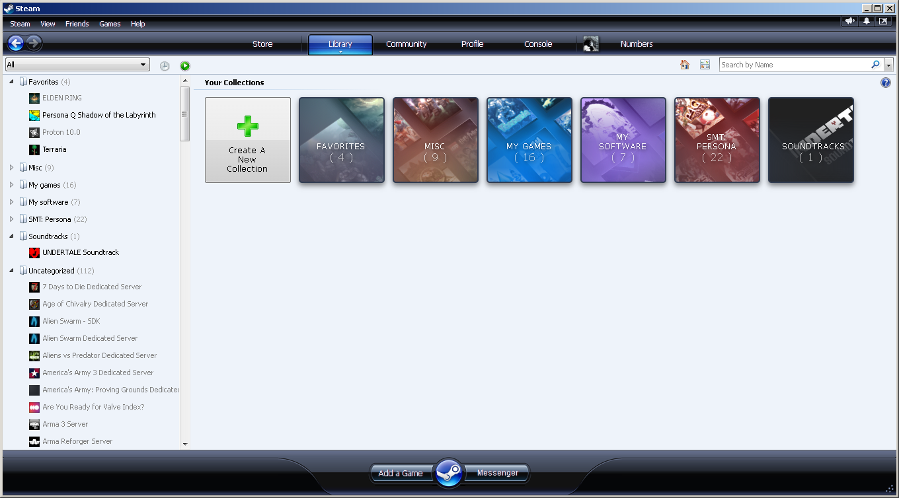
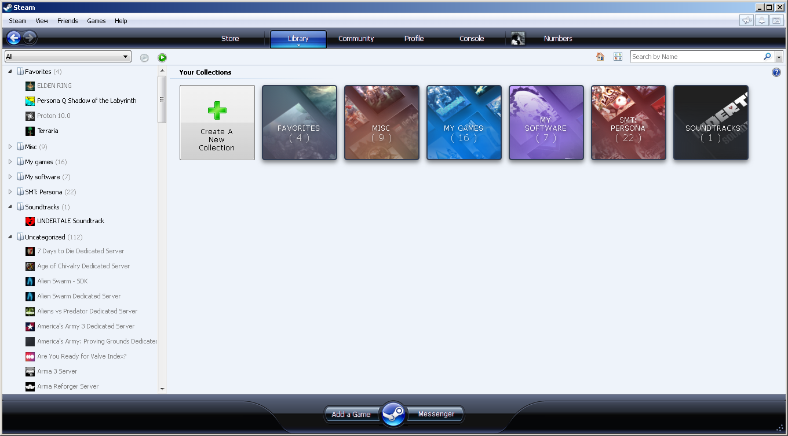
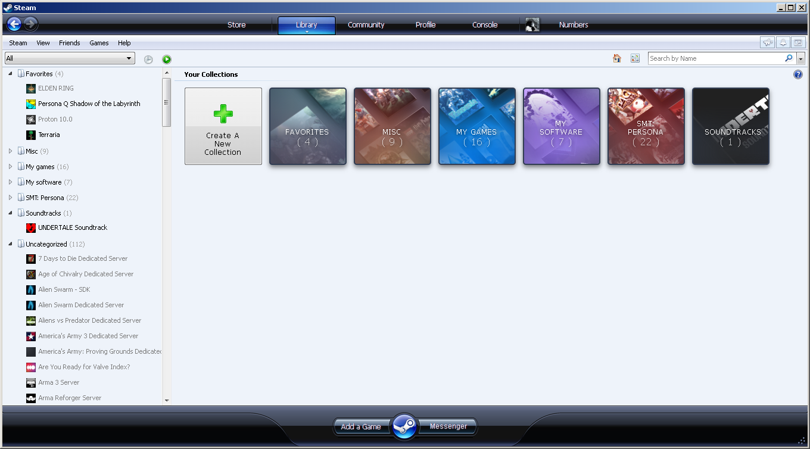

# Customization
The main theme is the aero basic theme, the media center theme has to be set in the skin's settings. Also, just to note, both library themes have matching friends list themes and have to be set manually in the skin's settings.

Options to change the hue/saturation of the ui, along with some color presets are included (This setting is still experimental and was designed for the AeroBasic theme, MediaCenter works but is a bit buggy). There's also an option to change the style of the bottom buttons.

  

Previews

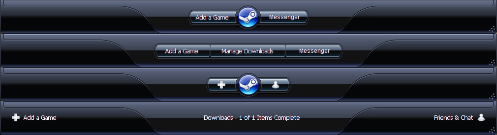
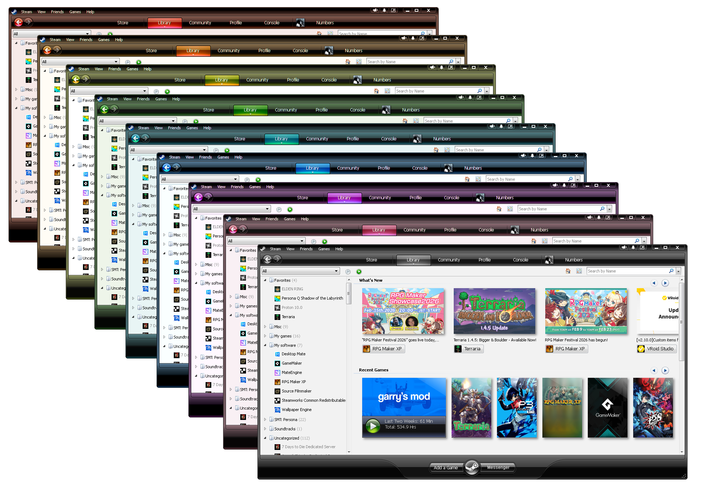

# ToDo
- [ ] Webkit
  - [ ] Store pages
  - [ ] Profile pages
  - [ ] Community pages
- [ ] Library
  - [x] AeroBasic
  - [x] AeroMediaCenter
  - [ ] AeroStandard
